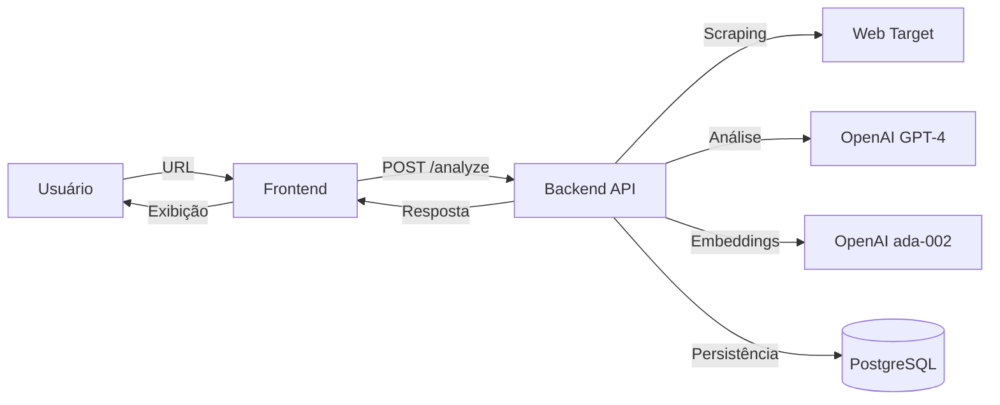

<div align="center">

# 🚀 BNA.dev

### Plataforma de Inteligência para Vendas B2B com IA

*Solução completa com RAG, análise automatizada e insights acionáveis para otimizar o processo de vendas*

[](https://fastapi.tiangolo.com)
[](https://reactjs.org)
[](https://www.postgresql.org)
[](https://openai.com)
[](https://www.docker.com)

[Funcionalidades](#-funcionalidades-principais) • [Instalação](#-instalação-e-configuração) • [Arquitetura](#-arquitetura) • [Documentação](#-documentação)

</div>

---

## 📋 Índice

- [Visão Geral](#-visão-geral)
- [Funcionalidades Principais](#-funcionalidades-principais)
- [Arquitetura](#-arquitetura)
- [Tecnologias Utilizadas](#-tecnologias-utilizadas)
- [Requisitos](#-requisitos)
- [Instalação e Configuração](#-instalação-e-configuração)
- [Uso da Plataforma](#-uso-da-plataforma)
- [API Endpoints](#-api-endpoints)
- [Estrutura do Projeto](#-estrutura-do-projeto)
- [Gerenciamento de Dados](#-gerenciamento-de-dados)
- [Deploy em Produção](#-deploy-em-produção)
- [Documentação](#-documentação)
- [Contribuição](#-contribuição)
- [Licença](#-licença)

---

## 🎯 Visão Geral

**BNA.dev** é uma plataforma de inteligência artificial desenvolvida para transformar o processo de vendas B2B. Através de análise automatizada de sites, RAG (Retrieval-Augmented Generation) e processamento de linguagem natural, a plataforma fornece insights profundos sobre empresas-alvo, permitindo que equipes de vendas se preparem de forma mais eficaz para reuniões comerciais.

### 🎪 Diferenciais

- **🤖 RAG Inteligente**: Chat contextual com busca vetorial semântica e integração web em tempo real
- **📊 Dashboard Executivo**: KPIs em tempo real com insights gerados por IA
- **🎯 Simulador de Objeções**: Sistema gamificado para treinamento de vendedores
- **📋 Kanban Pipeline**: Gestão visual de leads com drag-and-drop
- **🌐 Enriquecimento Multi-Fonte**: Consolida dados de Crunchbase, GitHub, LinkedIn, G2
- **⚡ Cache Inteligente**: Zero reprocessamento - análises armazenadas persistentemente
- **🔒 Segurança Corporativa**: Autenticação JWT, RBAC, proteção de dados

---

## ✨ Funcionalidades Principais

### 🤖 Chat RAG com Web Search Automático

Sistema de chat inteligente que combina:
- **Busca Vetorial Semântica**: Embeddings OpenAI (ada-002) com similaridade de cosseno
- **Web Search em Tempo Real**: Integração Google/DuckDuckGo para informações atualizadas
- **Contexto Enriquecido**: Combina histórico de análises + busca web + conversa
- **Citação de Fontes**: Transparência total sobre origem das informações

```bash
# Exemplos de uso
"Qual o stack tecnológico da Empresa X?"
"Compare as últimas 3 empresas que analisei"
"Quais empresas de SaaS B2B analisamos este mês?"
```

### 📊 Dashboard Executivo com IA

Visão consolidada em tempo real:
- **4 KPIs Principais**: Total Leads, Hot Leads, Análises/mês, Deal Score médio
- **Insights Automáticos**: IA gera 3-4 insights acionáveis baseados nos dados
- **Pipeline Distribution**: Visualização em gráfico de pizza
- **Tendências Semanais**: Gráfico de linha das últimas 8 semanas
- **Top 5 Leads**: Ranking automático com scoring
- **Activity Timeline**: Stream de atividades recentes
- **Auto-refresh**: Atualização automática a cada 2 minutos

### 📋 Kanban Board para Pipeline

Gestão visual de leads:
- **5 Estágios**: Lead → Qualificado → Proposta → Negociação → Fechado
- **Drag-and-Drop**: Movimentação intuitiva entre estágios
- **Sugestões de IA**: Próximas ações recomendadas por estágio
- **Estatísticas**: Taxa de conversão, tempo médio por estágio
- **Notas e Anexos**: Documentação completa por lead
- **Atribuição**: Designação de vendedores responsáveis

### 🎯 Simulador de Objeções

Treinamento gamificado com IA:
- **3 Níveis de Dificuldade**: Fácil, Médio, Difícil
- **Avaliação Automática**: Scoring 0-100 com feedback detalhado
- **Grades**: A+ a F baseado na performance
- **Objeções Contextualizadas**: Geradas baseadas em empresas reais analisadas
- **Tipos de Objeção**: Preço, Timing, Autoridade, Necessidade, Concorrência
- **Estatísticas de Progresso**: Tracking de evolução e performance

### 🔄 Comparação Inteligente de Empresas

Análise comparativa entre 2-5 empresas:
- **Comparação Lado a Lado**: Stack, Pricing, ICP, Produtos
- **Ranking de Prioridade**: Score gerado por IA
- **Oportunidades Únicas**: Insights específicos por empresa
- **Estratégia de Abordagem**: Recomendações personalizadas

### 🌐 Enriquecimento Multi-Fonte

Sistema automático de data enrichment:
- **Crunchbase**: Funding, investimentos, valuation
- **GitHub**: Tech stack real, atividade open-source
- **LinkedIn**: Company data, headcount, growth
- **News API**: Notícias recentes e menções na mídia
- **G2/Capterra**: Reviews, ratings, market position
- **Síntese por IA**: Consolidação inteligente em perfil executivo

### 📈 Análise de Sites com IA

Motor principal de análise:
- **Scraping Inteligente**: Extração otimizada de conteúdo web
- **Análise Estruturada**: 11 dimensões de análise (ICP, Stack, Pricing, etc.)
- **Deduplicação**: Cache por URL - nunca reprocessa a mesma empresa
- **Exportação**: CSV pronto para Google Sheets
- **Embeddings**: Vetorização automática para busca semântica

---

## 🏗️ Arquitetura

### Stack Tecnológico

```
┌─────────────────────────────────────────────────────────────┐
│                        FRONTEND                              │
│  React 18 + TypeScript + Vite + React Router + Recharts    │
│                    (Port 5173)                               │
└──────────────────────┬──────────────────────────────────────┘
                       │ REST API
┌──────────────────────▼──────────────────────────────────────┐
│                        BACKEND                               │
│         FastAPI + SQLAlchemy + Python 3.11+                 │
│                    (Port 8000)                               │
├─────────────────────────────────────────────────────────────┤
│  Services Layer:                                             │
│  • LLM (OpenAI GPT-4o-mini)                                 │
│  • Embeddings (OpenAI ada-002)                              │
│  • Web Scraping (BeautifulSoup + httpx)                     │
│  • Web Search (Google/DuckDuckGo)                           │
│  • RAG (Retrieval-Augmented Generation)                     │
└──────────────────────┬──────────────────────────────────────┘
                       │ SQLAlchemy ORM
┌──────────────────────▼──────────────────────────────────────┐
│                      DATABASE                                │
│              PostgreSQL 16 Alpine                            │
│                    (Port 5432)                               │
│  • Users • PageAnalyses • ChatMessages                      │
│  • TrainingSessions • AnalysisNotes                         │
└─────────────────────────────────────────────────────────────┘

┌─────────────────────────────────────────────────────────────┐
│                   ADMIN INTERFACE                            │
│                  Adminer (Port 8081)                         │
│         Gerenciamento visual do banco de dados              │
└─────────────────────────────────────────────────────────────┘
```

### Fluxo de Dados



---

## 🛠️ Tecnologias Utilizadas

### Backend
| Tecnologia | Versão | Finalidade |
|------------|--------|------------|
| **Python** | 3.11+ | Linguagem principal |
| **FastAPI** | 0.115.0 | Framework web assíncrono |
| **SQLAlchemy** | 2.0.35 | ORM para banco de dados |
| **PostgreSQL** | 16 | Banco de dados relacional |
| **OpenAI** | 0.28.1 | LLM e embeddings |
| **BeautifulSoup4** | 4.12.3 | Web scraping |
| **httpx** | 0.27.2 | Cliente HTTP assíncrono |
| **Pydantic** | 1.10.17 | Validação de dados |
| **python-jose** | 3.3.0 | JWT token handling |
| **passlib** | 1.7.4 | Hash de senhas (bcrypt) |

### Frontend
| Tecnologia | Versão | Finalidade |
|------------|--------|------------|
| **React** | 18.3.1 | Biblioteca UI |
| **TypeScript** | 5.6.2 | Type safety |
| **Vite** | 5.4.8 | Build tool |
| **React Router** | 6.26.2 | Navegação SPA |
| **Axios** | 1.7.7 | Cliente HTTP |
| **Recharts** | 2.10.3 | Gráficos e visualizações |
| **@dnd-kit** | 6.1.0/8.0.0 | Drag-and-drop |

### Infraestrutura
| Tecnologia | Versão | Finalidade |
|------------|--------|------------|
| **Docker** | Latest | Containerização |
| **Docker Compose** | Latest | Orquestração multi-container |
| **Adminer** | Latest | Interface de gerenciamento DB |
| **PostgreSQL** | 16-alpine | Banco de dados em container |

---

## 📋 Requisitos

### Ambiente de Desenvolvimento

- **Python**: 3.11 ou superior
- **Node.js**: 18 ou superior
- **Docker**: 20.10 ou superior
- **Docker Compose**: 2.0 ou superior (incluído no Docker Desktop)
- **Git**: Para clonar o repositório

### Chaves de API

- **OpenAI API Key**: Obrigatória para análises e chat
  - Obtenha em: https://platform.openai.com/api-keys
  - Modelos utilizados: `gpt-4o-mini`, `text-embedding-ada-002`

### Sistema Operacional

- ✅ **Windows** 10/11 (WSL2 recomendado para Docker)
- ✅ **macOS** 11+ (Apple Silicon e Intel)
- ✅ **Linux** (Ubuntu 20.04+, Debian, Fedora, etc.)

---

## 🚀 Instalação e Configuração

### Opção 1: Docker Compose (Recomendado)

A forma mais rápida e confiável de executar toda a stack:

#### 1. Clone o repositório

```bash
git clone https://github.com/matheus489/bna.git
cd bna
```

#### 2. Configure as variáveis de ambiente

```bash
# Windows (PowerShell)
Copy-Item config.env.example .env

# Linux/macOS
cp config.env.example .env
```

Edite o arquivo `.env` e configure sua chave OpenAI:

```env
# Segurança
SECRET_KEY=your-super-secret-key-change-in-production
ACCESS_TOKEN_EXPIRE_MINUTES=720

# Banco de dados (já configurado para Docker)
DATABASE_URL=postgresql+psycopg2://postgres:postgres@db:5432/bna

# CORS
CORS_ORIGINS=["http://localhost:5173"]

# OpenAI (OBRIGATÓRIO)
OPENAI_API_KEY=sk-your-key-here
OPENAI_MODEL=gpt-4o-mini
LLM_PROVIDER=openai
```

#### 3. Inicie todos os serviços

```bash
docker-compose up -d
```

Aguarde a inicialização (30-60 segundos). Verifique o status:

```bash
docker-compose ps
```

#### 4. Acesse a plataforma

| Serviço | URL | Descrição |
|---------|-----|-----------|
| **Frontend** | http://localhost:5173 | Interface principal |
| **Backend API** | http://localhost:8000 | API REST |
| **Documentação API** | http://localhost:8000/docs | Swagger UI interativo |
| **Adminer** | http://localhost:8081 | Gerenciamento de dados |
| **PostgreSQL** | localhost:5432 | Banco de dados |

#### 5. Parar os serviços

```bash
# Parar sem remover dados
docker-compose down

# Parar e remover volumes (CUIDADO: apaga dados)
docker-compose down -v
```

---

### Opção 2: Desenvolvimento Local

Para desenvolvimento com hot reload e debugging:

#### 1. Clone e configure

```bash
git clone https://github.com/matheus489/bna.git
cd bna
cp config.env.example .env
```

Configure o `.env` conforme a Opção 1.

#### 2. Inicie o PostgreSQL

```bash
docker-compose up -d db
```

#### 3. Configure o Backend

```bash
# Crie um ambiente virtual
python -m venv .venv

# Ative o ambiente virtual
# Windows (PowerShell)
.venv\Scripts\activate
# Windows (CMD)
.venv\Scripts\activate.bat
# Linux/macOS
source .venv/bin/activate

# Instale as dependências
pip install -r backend/requirements.txt

# Inicialize o banco de dados
python -m backend.app.scripts.init_db

# Inicie o servidor de desenvolvimento
uvicorn backend.app.main:app --reload --port 8000
```

O backend estará disponível em http://localhost:8000

#### 4. Configure o Frontend

Em outro terminal:

```bash
cd frontend

# Instale as dependências
npm install

# Inicie o servidor de desenvolvimento
npm run dev
```

O frontend estará disponível em http://localhost:5173

---

### Configuração do Adminer

Para acessar o gerenciador de banco de dados:

1. Acesse http://localhost:8081
2. Preencha os dados de conexão:

```
Sistema:   PostgreSQL
Servidor:  bna-db-1  (se usando Docker Compose)
Usuário:   postgres
Senha:     postgres
Banco:     bna
```

3. Clique em **Entrar**

---

## 🎮 Uso da Plataforma

### 1. Registro e Autenticação

```bash
# Primeiro acesso
1. Acesse http://localhost:5173
2. Clique em "Registrar"
3. Preencha email e senha
4. Faça login com suas credenciais
```

O token JWT é armazenado no `localStorage` e incluído automaticamente em todas as requisições.

### 2. Analisar Empresa

```bash
1. Navegue para "Analisar"
2. Insira a URL da empresa (ex: https://empresa.com)
3. Clique em "Analisar"
4. Aguarde o processamento (10-30 segundos)
5. Visualize os insights estruturados
```

**Seções da Análise:**
- 📊 Resumo Executivo
- 🎯 ICP (Ideal Customer Profile)
- 🛍️ Produtos e Serviços
- 💰 Pricing e Business Model
- 🔧 Stack Tecnológico
- 📞 Contatos e Stakeholders
- 🏢 Informações da Empresa
- 🎯 Oportunidades de Vendas
- 📊 Análise de Mercado
- 🎯 Insights Estratégicos
- 📈 Score de Prioridade

### 3. Chat RAG

```bash
1. Navegue para "Chat"
2. Digite sua pergunta
3. Marque "Buscar na Web" se quiser informações atualizadas
4. Envie a mensagem
5. Visualize a resposta com fontes citadas
```

**Exemplos de perguntas:**
- "Qual o stack tecnológico da última empresa analisada?"
- "Compare as 3 empresas de SaaS que analisei"
- "Quais empresas têm funding recente?"
- "Busque notícias sobre [empresa]"

### 4. Dashboard

```bash
1. Navegue para "Dashboard"
2. Visualize KPIs em tempo real
3. Leia insights gerados por IA
4. Analise tendências e pipeline
5. Confira top leads da semana
```

### 5. Kanban Board

```bash
1. Navegue para "Kanban"
2. Visualize leads organizados por estágio
3. Arraste cards entre colunas para atualizar status
4. Clique em um card para ver detalhes
5. Adicione notas e anexos
6. Atribua vendedores responsáveis
```

### 6. Simulador de Objeções

```bash
1. Navegue para "Treinar"
2. Selecione uma empresa analisada
3. Escolha o nível de dificuldade
4. Leia a objeção apresentada
5. Escreva sua resposta
6. Envie e receba avaliação com score
7. Veja feedback detalhado e sugestão
8. Acompanhe suas estatísticas
```

### 7. Comparação de Empresas

```bash
1. Navegue para "Comparar"
2. Selecione 2-5 empresas analisadas
3. Clique em "Comparar"
4. Visualize análise comparativa
5. Confira ranking de prioridade
6. Leia estratégias de abordagem
```

### 8. Histórico e Exportação

```bash
# Visualizar histórico
1. Navegue para "Histórico"
2. Veja todas as análises realizadas
3. Use a busca para filtrar
4. Clique em uma análise para ver detalhes

# Exportar para CSV
1. Na página de histórico
2. Clique em "Exportar CSV"
3. Arquivo será baixado automaticamente
4. Importe no Google Sheets: File > Import > Upload
```

---

## 🔌 API Endpoints

### Autenticação

```http
POST /auth/register
Content-Type: application/json

{
  "email": "usuario@exemplo.com",
  "password": "senha-segura"
}
```

```http
POST /auth/login
Content-Type: application/x-www-form-urlencoded

username=usuario@exemplo.com&password=senha-segura

Response: { "access_token": "...", "token_type": "bearer" }
```

### Análise de Sites

```http
POST /analyze
Authorization: Bearer {token}
Content-Type: application/json

{
  "url": "https://exemplo.com"
}
```

```http
GET /history
Authorization: Bearer {token}

Response: [{ "id": 1, "url": "...", "title": "...", "summary": "..." }]
```

```http
GET /history/export/csv
Authorization: Bearer {token}

Response: CSV file download
```

### Chat RAG

```http
POST /chat
Authorization: Bearer {token}
Content-Type: application/json

{
  "message": "Qual o stack da empresa X?",
  "use_web_search": true,
  "max_history": 10
}

Response: {
  "response": "...",
  "sources": [...],
  "message_id": 123
}
```

```http
GET /chat/history
Authorization: Bearer {token}

Response: [{ "id": 1, "role": "user", "content": "...", "created_at": "..." }]
```

```http
DELETE /chat/history
Authorization: Bearer {token}

Response: { "message": "Chat history cleared" }
```

### Dashboard

```http
GET /dashboard
Authorization: Bearer {token}

Response: {
  "kpis": { "total_leads": 45, "hot_leads": 12, ... },
  "insights": ["Insight 1", "Insight 2", ...],
  "pipeline_distribution": {...},
  "trends": {...},
  "top_leads": [...],
  "activity_timeline": [...]
}
```

### Kanban

```http
GET /kanban/pipeline
Authorization: Bearer {token}

Response: {
  "lead": [...],
  "qualified": [...],
  "proposal": [...],
  "negotiation": [...],
  "closed": [...]
}
```

```http
PATCH /kanban/analysis/{id}/stage
Authorization: Bearer {token}
Content-Type: application/json

{
  "stage": "qualified"
}
```

### Simulador de Objeções

```http
POST /training/generate-objections
Authorization: Bearer {token}
Content-Type: application/json

{
  "analysis_id": 123,
  "difficulty": "medium"
}

Response: {
  "objection": "...",
  "type": "price",
  "difficulty": "medium"
}
```

```http
POST /training/submit-response
Authorization: Bearer {token}
Content-Type: application/json

{
  "objection_id": 456,
  "response": "Minha resposta à objeção..."
}

Response: {
  "score": 85,
  "grade": "B+",
  "feedback": "...",
  "suggested_response": "..."
}
```

```http
GET /training/stats
Authorization: Bearer {token}

Response: {
  "total_sessions": 42,
  "average_score": 78.5,
  "improvement_rate": "+12%",
  "by_difficulty": {...}
}
```

### Comparação

```http
POST /compare
Authorization: Bearer {token}
Content-Type: application/json

{
  "analysis_ids": [1, 2, 3]
}

Response: {
  "comparison": "...",
  "ranking": [...],
  "opportunities": {...}
}
```

### Enriquecimento

```http
POST /enrichment/analyze/{analysis_id}
Authorization: Bearer {token}

Response: {
  "crunchbase_data": {...},
  "github_data": {...},
  "linkedin_data": {...},
  "news_data": {...},
  "synthesis": "..."
}
```

### Health Check

```http
GET /health

Response: { "status": "ok" }
```

**Documentação Interativa**: Acesse http://localhost:8000/docs para explorar todos os endpoints com Swagger UI.

---

## 📁 Estrutura do Projeto

```
BNA/
├── backend/
│   ├── app/
│   │   ├── __init__.py
│   │   ├── main.py                 # Ponto de entrada FastAPI
│   │   ├── config.py               # Configurações e variáveis de ambiente
│   │   ├── database.py             # Conexão e sessão do banco
│   │   ├── models.py               # Modelos SQLAlchemy (ORM)
│   │   ├── schemas.py              # Schemas Pydantic (validação)
│   │   ├── security.py             # JWT e autenticação
│   │   ├── routers/                # Endpoints da API
│   │   │   ├── __init__.py
│   │   │   ├── auth.py             # Autenticação (login/register)
│   │   │   ├── analyze.py          # Análise de sites
│   │   │   ├── chat.py             # Chat RAG
│   │   │   ├── dashboard.py        # Dashboard executivo
│   │   │   ├── kanban.py           # Kanban pipeline
│   │   │   ├── training.py         # Simulador de objeções
│   │   │   ├── history.py          # Histórico de análises
│   │   │   ├── reports.py          # Relatórios detalhados
│   │   │   ├── enrichment.py       # Enriquecimento multi-fonte
│   │   │   └── admin.py            # Endpoints administrativos
│   │   ├── services/               # Lógica de negócio
│   │   │   ├── llm.py              # Integração OpenAI GPT
│   │   │   ├── embeddings.py       # Busca vetorial semântica
│   │   │   ├── scraper.py          # Web scraping
│   │   │   ├── web_search.py       # Pesquisa na web
│   │   │   ├── comparison.py       # Comparação de empresas
│   │   │   ├── objections.py       # Geração de objeções
│   │   │   ├── market_analysis.py  # Análise de mercado
│   │   │   ├── text_formatter.py   # Formatação de texto
│   │   │   ├── hierarchical_rag.py # RAG hierárquico (exp.)
│   │   │   ├── rag_evaluator.py    # Avaliação RAG (exp.)
│   │   │   └── multi_source_enrichment.py  # Data enrichment
│   │   ├── scripts/
│   │   │   └── init_db.py          # Inicialização do banco
│   │   └── static/
│   │       └── logo.png
│   ├── requirements.txt            # Dependências Python
│   └── Dockerfile                  # Container backend
│
├── frontend/
│   ├── src/
│   │   ├── pages/
│   │   │   ├── App.tsx             # Componente raiz
│   │   │   ├── Login.tsx           # Autenticação
│   │   │   ├── Analyze.tsx         # Análise de sites
│   │   │   ├── Chat.tsx            # Chat RAG
│   │   │   ├── Dashboard.tsx       # Dashboard executivo
│   │   │   ├── Kanban.tsx          # Kanban board
│   │   │   ├── KanbanModal.tsx     # Modal de detalhes
│   │   │   ├── Training.tsx        # Simulador de objeções
│   │   │   ├── History.tsx         # Histórico
│   │   │   ├── Compare.tsx         # Comparação
│   │   │   ├── Settings.tsx        # Configurações
│   │   │   └── Admin.tsx           # Painel admin
│   │   ├── components/             # Componentes reutilizáveis
│   │   ├── contexts/               # Context API
│   │   ├── styles/                 # Estilos globais
│   │   └── main.tsx                # Entry point
│   ├── public/
│   │   ├── favicon.ico
│   │   ├── favicon.png
│   │   └── favicon.jpg
│   ├── index.html
│   ├── package.json                # Dependências Node.js
│   ├── tsconfig.json               # Configuração TypeScript
│   ├── vite.config.ts              # Configuração Vite
│   └── Dockerfile                  # Container frontend
│
├── docker-compose.yml              # Orquestração completa
├── config.env.example              # Template de configuração
├── .env                            # Variáveis de ambiente (criar)
├── README.md                       # Este arquivo
│
├── DOCUMENTACAO_COMPLETA.md        # Documentação técnica detalhada
├── DOCUMENTACAO_API.md             # Especificação de API
├── DOCUMENTACAO_FRONTEND.md        # Guia do frontend
├── ANALISE_MELHORIAS_EXTRAORDINARIAS.md
├── ENTREGA_FINAL_RESUMO.md
├── GUIA_RAPIDO_TESTE.md
├── COMANDOS_INSTALACAO.md
├── RAG_IMPLEMENTADO.txt
│
├── deploy.ps1                      # Script deploy Windows
├── deploy.sh                       # Script deploy Linux/macOS
├── railway.json                    # Configuração Railway
├── render.yaml                     # Configuração Render
└── fly.toml                        # Configuração Fly.io
```

---

## 🗄️ Gerenciamento de Dados

### Via Adminer (Interface Web)

Acesse http://localhost:8081 e use as credenciais:

```
Sistema:   PostgreSQL
Servidor:  bna-db-1
Usuário:   postgres
Senha:     postgres
Banco:     bna
```

**Funcionalidades disponíveis:**
- ✅ Visualizar todas as tabelas
- ✅ Executar queries SQL customizadas
- ✅ Exportar dados (CSV, JSON, SQL)
- ✅ Importar dados
- ✅ Editar registros manualmente
- ✅ Ver relacionamentos e constraints

### Queries Úteis

```sql
-- Ver todas as análises
SELECT id, url, title, stage, created_at 
FROM page_analyses 
ORDER BY created_at DESC;

-- Contar análises por usuário
SELECT u.email, COUNT(pa.id) as total_analises 
FROM users u 
LEFT JOIN page_analyses pa ON u.id = pa.owner_id 
GROUP BY u.email;

-- Ver mensagens recentes do chat
SELECT cm.role, cm.content, u.email, cm.created_at 
FROM chat_messages cm 
JOIN users u ON cm.user_id = u.id 
ORDER BY cm.created_at DESC 
LIMIT 20;

-- Estatísticas de treinamento por usuário
SELECT 
    u.email,
    COUNT(ts.id) as total_sessions,
    AVG(ts.score) as avg_score,
    MAX(ts.score) as best_score
FROM users u
LEFT JOIN training_sessions ts ON u.id = ts.user_id
GROUP BY u.email;

-- Pipeline distribution
SELECT stage, COUNT(*) as count 
FROM page_analyses 
GROUP BY stage 
ORDER BY 
    CASE stage
        WHEN 'lead' THEN 1
        WHEN 'qualified' THEN 2
        WHEN 'proposal' THEN 3
        WHEN 'negotiation' THEN 4
        WHEN 'closed' THEN 5
    END;
```

### Via Docker CLI

```bash
# Acessar PostgreSQL via terminal
docker exec -it bna-db-1 psql -U postgres -d bna

# Comandos úteis no psql
\dt              # Listar tabelas
\d table_name    # Descrever estrutura de uma tabela
\q               # Sair

# Fazer backup do banco
docker exec bna-db-1 pg_dump -U postgres bna > backup_bna_$(date +%Y%m%d).sql

# Restaurar backup
docker exec -i bna-db-1 psql -U postgres bna < backup_bna_20250101.sql

# Ver logs do banco
docker-compose logs -f db
```

---

## 🐳 Docker - Comandos Úteis

```bash
# Iniciar todos os serviços
docker-compose up -d

# Ver logs em tempo real
docker-compose logs -f

# Ver logs de um serviço específico
docker-compose logs -f backend
docker-compose logs -f frontend
docker-compose logs -f db

# Ver status dos containers
docker-compose ps

# Reiniciar um serviço
docker-compose restart backend

# Parar todos os serviços
docker-compose down

# Parar e remover volumes (CUIDADO: apaga dados)
docker-compose down -v

# Rebuild de um serviço específico
docker-compose up -d --build backend

# Acessar shell de um container
docker-compose exec backend bash
docker-compose exec frontend sh
docker-compose exec db psql -U postgres -d bna

# Ver uso de recursos
docker stats

# Limpar containers/imagens não usadas
docker system prune -a
```

---

## 🚀 Deploy em Produção

### Segurança - Checklist Obrigatório

Antes de fazer deploy em produção:

- [ ] **Altere a `SECRET_KEY`** no `.env`:
  ```bash
  # Gere uma chave segura
  python -c "import secrets; print(secrets.token_urlsafe(32))"
  ```
- [ ] **Use senhas fortes** para PostgreSQL
- [ ] **Configure CORS** adequadamente para seu domínio
- [ ] **Remova ou proteja** o Adminer em produção
- [ ] **Force HTTPS/TLS** em toda comunicação
- [ ] **Configure backup automático** do banco de dados
- [ ] **Adicione rate limiting** nas APIs críticas
- [ ] **Configure monitoring** e alertas
- [ ] **Revise logs** regularmente
- [ ] **Defina políticas de senha** fortes
- [ ] **Implemente IP whitelisting** se aplicável

### Plataformas Suportadas

| Plataforma | Custo Inicial | Facilidade | Docker | Banco Gerenciado | Recomendação |
|------------|---------------|-----------|---------|------------------|--------------|
| **Railway** | $5/mês | ⭐⭐⭐⭐⭐ | ✅ | ✅ | 🏆 Melhor para MVP |
| **Render** | Grátis | ⭐⭐⭐⭐ | ✅ | ✅ | 💚 Alternativa grátis |
| **Fly.io** | Grátis* | ⭐⭐⭐ | ✅ | ⚠️ Manual | ⚡ Baixa latência |
| **DigitalOcean** | $12/mês | ⭐⭐⭐⭐ | ✅ | ✅ | 🏢 Produção enterprise |
| **AWS (ECS)** | $20+/mês | ⭐⭐ | ✅ | ✅ | 🔧 Máxima flexibilidade |
| **GCP (Cloud Run)** | Pay-per-use | ⭐⭐⭐ | ✅ | ✅ | 📊 Escalabilidade |

*Fly.io: Requer cartão de crédito, mas tem free tier generoso

### Deploy Rápido - Railway (Recomendado)

```bash
# 1. Faça commit das mudanças locais
git add .
git commit -m "Preparando para deploy"
git push origin main

# 2. Acesse Railway
# https://railway.app

# 3. Crie novo projeto
# - "New Project" > "Deploy from GitHub repo"
# - Selecione seu repositório BNA

# 4. Configure variáveis de ambiente
# No dashboard Railway, adicione:
OPENAI_API_KEY=sk-your-key-here
SECRET_KEY=your-generated-secret-key
DATABASE_URL=${{Postgres.DATABASE_URL}}  # Railway injeta automaticamente
CORS_ORIGINS=["https://seu-dominio.railway.app"]

# 5. Deploy automático!
# Railway detecta docker-compose.yml e faz deploy
```

### Deploy - Render

```bash
# 1. Acesse Render
# https://render.com

# 2. Crie Web Service
# - "New" > "Web Service"
# - Conecte seu repositório GitHub

# 3. Configure Build
Build Command: docker-compose build backend
Start Command: docker-compose up backend

# 4. Configure variáveis de ambiente
# Adicione as mesmas variáveis do Railway

# 5. Adicione PostgreSQL
# "New" > "PostgreSQL"
# Copie a DATABASE_URL interna

# 6. Deploy!
```

### Arquitetura de Produção

```
                                 ┌─────────────┐
                                 │   CDN/Nginx │
                                 │  (Frontend) │
                                 └──────┬──────┘
                                        │
                                 ┌──────▼──────┐
                                 │ Load Balancer│
                                 └──────┬───────┘
                                        │
                    ┌───────────────────┼───────────────────┐
                    │                   │                   │
             ┌──────▼──────┐    ┌──────▼──────┐    ┌──────▼──────┐
             │  Backend 1   │    │  Backend 2   │    │  Backend N   │
             │  (FastAPI)   │    │  (FastAPI)   │    │  (FastAPI)   │
             └──────┬───────┘    └──────┬───────┘    └──────┬───────┘
                    │                   │                   │
                    └───────────────────┼───────────────────┘
                                        │
                                 ┌──────▼──────┐
                                 │  PostgreSQL  │
                                 │  (Managed)   │
                                 └──────────────┘
```

**Componentes:**
- **Frontend**: Build estático servido via CDN ou Nginx
- **Backend**: Múltiplas instâncias FastAPI (auto-scaling)
- **Database**: PostgreSQL gerenciado com backup automático
- **Cache**: Redis para sessões e cache (opcional)
- **Storage**: S3 para anexos e arquivos (opcional)
- **Monitoring**: DataDog, New Relic ou Sentry
- **SSL/TLS**: Certificados automáticos (Let's Encrypt)

### Custos Estimados

**Desenvolvimento/MVP:**
- Railway: $5-10/mês
- Render: $0-7/mês (free tier disponível)
- OpenAI API: $5-20/mês (uso moderado)
- **Total: $10-35/mês**

**Produção (Tráfego médio - 1000 usuários):**
- Hospedagem: $25-50/mês
- Database: $15-25/mês
- OpenAI API: $100-300/mês
- CDN: $5-15/mês
- Monitoring: $10-30/mês
- **Total: $155-420/mês**

**Enterprise (Tráfego alto - 10k+ usuários):**
- Infraestrutura: $200-500/mês
- Database: $50-150/mês
- OpenAI API: $500-2000/mês
- CDN + Storage: $50-100/mês
- Monitoring + Logs: $50-150/mês
- **Total: $850-2900/mês**

---

## 📚 Documentação

### Documentação Técnica Completa

- **[DOCUMENTACAO_COMPLETA.md](DOCUMENTACAO_COMPLETA.md)** - Arquitetura detalhada, fluxo de dados, modelos
- **[DOCUMENTACAO_API.md](DOCUMENTACAO_API.md)** - Especificação completa de todos os endpoints
- **[DOCUMENTACAO_FRONTEND.md](DOCUMENTACAO_FRONTEND.md)** - Guia do frontend, componentes e estilos

### Guias de Uso

- **[GUIA_RAPIDO_TESTE.md](GUIA_RAPIDO_TESTE.md)** - Roteiro de teste das funcionalidades
- **[COMANDOS_INSTALACAO.md](COMANDOS_INSTALACAO.md)** - Instalação passo a passo detalhada

### Documentação de Entregas

- **[ENTREGA_FINAL_RESUMO.md](ENTREGA_FINAL_RESUMO.md)** - Resumo executivo da entrega

### Swagger UI Interativo

Acesse http://localhost:8000/docs para:
- ✅ Explorar todos os endpoints
- ✅ Testar requisições diretamente no navegador
- ✅ Ver schemas de request/response
- ✅ Verificar códigos de status

### Redoc

Documentação alternativa: http://localhost:8000/redoc

---

### Padrões de Commit

Seguimos [Conventional Commits](https://www.conventionalcommits.org/):

```
feat: nova funcionalidade
fix: correção de bug
docs: documentação
style: formatação (sem mudança de código)
refactor: refatoração de código
test: adição de testes
chore: manutenção/configuração
```

### Código de Conduta

- ✅ Seja respeitoso e inclusivo
- ✅ Critique código, não pessoas
- ✅ Documente suas mudanças
- ✅ Teste antes de submeter PR
- ✅ Mantenha o estilo de código consistente

---

## 🧪 Testes

### Backend

```bash
# Ative o ambiente virtual
source .venv/bin/activate  # Linux/macOS
.venv\Scripts\activate     # Windows

# Rode os testes (quando implementados)
pytest backend/tests/

# Linting
flake8 backend/app/
black backend/app/ --check
```

### Frontend

```bash
cd frontend

# Testes (quando implementados)
npm test

# Linting
npm run lint

# Type checking
npm run type-check

# Build de produção
npm run build
```

---

## 🐛 Troubleshooting

### Problemas Comuns

#### "Port 5432 already in use"
```bash
# Verifique se há outro PostgreSQL rodando
# Windows
netstat -ano | findstr :5432
# Linux/macOS
lsof -i :5432

# Pare o serviço conflitante ou mude a porta no docker-compose.yml
```

#### "OpenAI API Key not found"
```bash
# Verifique se o .env está configurado
cat .env  # Linux/macOS
type .env  # Windows

# Certifique-se de que OPENAI_API_KEY está definida
# Reinicie o backend após configurar
```

#### "Connection to database failed"
```bash
# Verifique se o container do DB está rodando
docker-compose ps

# Veja os logs do banco
docker-compose logs db

# Reinicie o serviço
docker-compose restart db
```

#### "Frontend não conecta ao backend"
```bash
# Verifique se o backend está rodando
curl http://localhost:8000/health

# Verifique CORS no config.py
# CORS_ORIGINS deve incluir http://localhost:5173
```

#### "Docker build falha"
```bash
# Limpe cache do Docker
docker system prune -a

# Rebuild do zero
docker-compose build --no-cache
docker-compose up -d
```

### Logs Detalhados

```bash
# Ver logs de todos os serviços
docker-compose logs -f

# Ver últimas 100 linhas de um serviço
docker-compose logs --tail=100 backend

# Logs do PostgreSQL
docker-compose logs db

# Logs em tempo real do backend
docker-compose logs -f backend
```

---

## 📞 Suporte

### Reportar Bugs

Para reportar bugs, abra uma [issue no GitHub](https://github.com/seu-usuario/bna/issues) com:

1. **Descrição do problema**
2. **Passos para reproduzir**
3. **Comportamento esperado**
4. **Comportamento atual**
5. **Ambiente** (OS, Docker version, etc.)
6. **Logs relevantes**

### Solicitar Features

Para solicitar novas funcionalidades, abra uma [issue no GitHub](https://github.com/matheus489/bna/issues) com:

1. **Descrição da feature**
2. **Caso de uso**
3. **Benefícios esperados**
4. **Sugestões de implementação** (opcional)

---

## 📜 Licença

Este projeto está sob a licença MIT. Veja o arquivo [LICENSE](LICENSE) para mais detalhes.

```
MIT License

Copyright (c) 2025 BNA.dev

Permission is hereby granted, free of charge, to any person obtaining a copy
of this software and associated documentation files (the "Software"), to deal
in the Software without restriction, including without limitation the rights
to use, copy, modify, merge, publish, distribute, sublicense, and/or sell
copies of the Software, and to permit persons to whom the Software is
furnished to do so, subject to the following conditions:

The above copyright notice and this permission notice shall be included in all
copies or substantial portions of the Software.

THE SOFTWARE IS PROVIDED "AS IS", WITHOUT WARRANTY OF ANY KIND, EXPRESS OR
IMPLIED, INCLUDING BUT NOT LIMITED TO THE WARRANTIES OF MERCHANTABILITY,
FITNESS FOR A PARTICULAR PURPOSE AND NONINFRINGEMENT. IN NO EVENT SHALL THE
AUTHORS OR COPYRIGHT HOLDERS BE LIABLE FOR ANY CLAIM, DAMAGES OR OTHER
LIABILITY, WHETHER IN AN ACTION OF CONTRACT, TORT OR OTHERWISE, ARISING FROM,
OUT OF OR IN CONNECTION WITH THE SOFTWARE OR THE USE OR OTHER DEALINGS IN THE
SOFTWARE.
```

---

### Tecnologias e Bibliotecas

Agradecimentos às tecnologias open-source que tornaram este projeto possível:

- [FastAPI](https://fastapi.tiangolo.com/) - Framework web Python moderno
- [React](https://react.dev/) - Biblioteca UI
- [PostgreSQL](https://www.postgresql.org/) - Banco de dados relacional
- [OpenAI](https://openai.com/) - Modelos de linguagem e embeddings
- [Docker](https://www.docker.com/) - Containerização
- [SQLAlchemy](https://www.sqlalchemy.org/) - ORM Python
- [Vite](https://vitejs.dev/) - Build tool frontend
- [Recharts](https://recharts.org/) - Biblioteca de gráficos
- [dnd-kit](https://dndkit.com/) - Drag-and-drop
- E muitas outras bibliotecas incríveis!

---

## 🎯 Roadmap

### ✅ Versão 1.0 (Atual)

- [x] Sistema de autenticação JWT
- [x] Análise de sites com IA
- [x] Chat RAG com busca vetorial
- [x] Dashboard executivo
- [x] Kanban pipeline
- [x] Simulador de objeções
- [x] Comparação de empresas
- [x] Enriquecimento multi-fonte
- [x] Exportação CSV
- [x] Docker Compose completo

### 🚧 Versão 1.1 (Em Desenvolvimento)

- [ ] **Testes automatizados** (unittest, pytest, jest)
- [ ] **CI/CD pipeline** (GitHub Actions)
- [ ] **Cache Redis** para performance
- [ ] **Rate limiting** nas APIs
- [ ] **Webhooks** para integrações
- [ ] **Export PDF** de relatórios
- [ ] **Notificações** em tempo real
- [ ] **Dark mode** completo

### 🔮 Versão 2.0 (Futuro)

- [ ] **Integração CRM** (Salesforce, HubSpot, Pipedrive)
- [ ] **API Pública** com documentação
- [ ] **Análise de sentimento** avançada
- [ ] **Predição de vendas** com ML
- [ ] **Multi-idioma** (i18n)
- [ ] **Mobile app** nativo (React Native)
- [ ] **Integração social** (LinkedIn, Twitter)
- [ ] **Marketplace** de integrações
- [ ] **Analytics avançado** (DataDog, Mixpanel)
- [ ] **Colaboração em tempo real**

---

## 📊 Status do Projeto


**Última atualização:** Outubro 2025

---

<div align="center">

## 🌟 Se este projeto foi útil, considere dar uma estrela!

**Desenvolvido com ❤️ para revolucionar vendas B2B**

[⬆ Voltar ao topo](#-bnadev)

</div>
